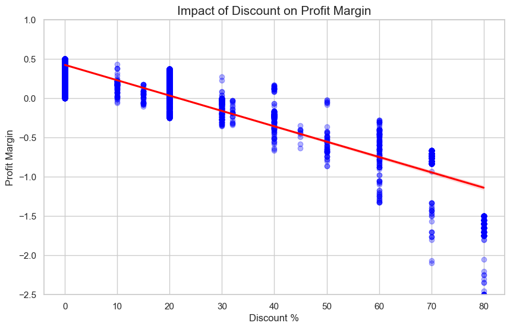

# Sales & Profitability Analysis (Work in Progress)

**Dataset:** This analysis utilizes the [Superstore Dataset](https://www.kaggle.com/datasets/vivek468/superstore-dataset-final) from Kaggle, which provides comprehensive data on sales, profits, and customer segments.

This repository contains an ongoing data analysis project focused on understanding sales performance and profitability drivers. The analysis is performed using Python, Pandas and statsmodels on a retail dataset.

## Key Business insights

### The 20% Discount Tipping Point
- Our analysis shows a direct negative correlation between discounts and profitability. Transactions with discounts exceeding 20% are statistically likely to result in a net loss.

### Strategic Recommendations
- **Pricing:** Require managerial approval for any discounts exceeding 20%.
- **Inventory Focus:** Prioritize **Technology** and **Office Supplies**, which show significantly higher margin efficiency than Furniture.
- **Volume vs. Profit:** Disprove the "volume fixes everything" myth; quantity sold does not statistically improve the profit margin (p > 0.05).

## Project Overview
The goal of this project is to identify which product categories, customer segments, and regional markets contribute most to the company's bottom line, as well as to evaluate the impact of discounting strategies.

## Current Progress

### 1. Product & Category Profitability (In progress)
Analyze which products and categories generate the highest sales and profit.
- Sorting sub-categories by profit within each parent category to identify top performers and loss-makers.

### 2. Customer Segments & Regional Analysis (Planned)
Investigating how sales and profits are distributed across different customer segments (Consumer, Corporate, Home office) and geographical regions.
- Customer segment percentages
- Identifying the most profitable countries.

### 3. Discount Impact Analysis (Completed)
Evaluating whether discounting strategies increase or decrease profit
- Effect of discount on product volume and profit

## Tech Stack
- **Python** 3.12.6
- **Libraries:** Pandas (Data manipulation), Matplotlib / Seaborn (visualization), statsmodels (statistical modeling)
- **Environment:** Jupyter Notebook

## How to use (In progress)

## Results (In progress)

### Linear regression: Factors Driving Profit Margin

Performed a Multiple Linear Regression (OLS) to identify key drivers of profitability. $$\text{Profit Margin} \sim \text{Quantity} + \text{Discount} + \text{Segment} + \text{Category} + \text{Region}$$ The model achieved an **R-squared** of 0.756.

- **Key Insight:** Discounting is the strongest predictor of loss. A 10% increase in discount leads to a ~**19%** drop in profit margin.

- **Category Performance:** Office Supplies and Technology outperform Furniture in terms of margin efficiency.

- **Statistical Discovery:** Order quantity does not have a statistically significant impact on the profit margin (p = 0.735), suggesting that scaling volume doesn't fix poor pricing strategies.

### 